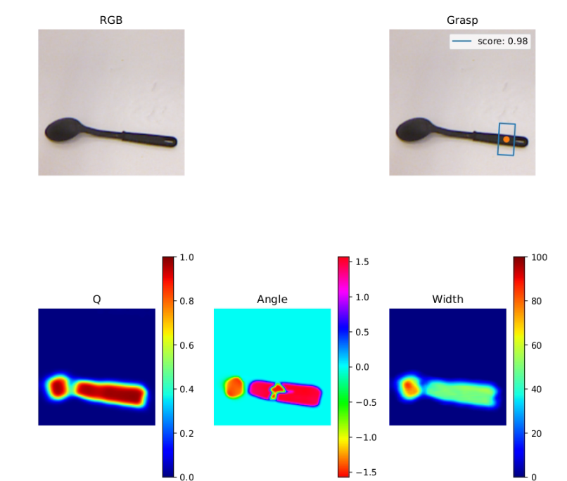

# Code for our paper <a href="https://link.springer.com/content/pdf/10.1007/s10489-021-03011-z.pdf">"Generative model based robotic grasp pose prediction with limited dataset"</a>
### Paper accepted at Springer, Applied Intelligence Journal on 13 Nov 2021.

### Article Link: <a href="https://doi.org/10.1007/s10489-021-03011-z"> Springer</a>

# Overview
In our work we present a lightweight approach to perform grasp operation for robots. We propose 2 models in our paper: 
</br>
</br>
1.**"GI-NNet"** - A supervised learning approach employing combination of ResNet and Inception Net.
</br>
2.**"RGI-NNet"** - A semi-supervised approach for grasp prediction, using combination of GI-NNet and VQ-VAE.

### Sample Prediction given an RGB-D image as input:
<p align="center">
  
</p>
</br>

# Train and Evaluate

1. Train GI-NNet model
```
python train_network_ginnet.py --dataset cornell --dataset-path <path_to_dataset_folder> --description run  --num-workers 4
```

2. Eval GI-NNet model
```
python evaluate.py --network <path_to_saved_netowrk>  --dataset cornell --dataset-path <path_to_dataset_folder> --iou-eval --num-workers 4
```

3. Train RGI-NNet model
```
python train_network_vq_vae_rginnet.py --dataset cornell --dataset-path <path_to_dataset_folder> --description run  --num-workers 4
```

4. Eval RGI-NNet model
```
python evaluate_vq_vae.py --network <path_to_saved_netowrk> --dataset cornell --dataset-path <path_to_dataset_folder> --iou-eval --num-workers 4
```

# Citation

```
@ARTICLE{Shukla2022-lc,
  title    = "Generative model based robotic grasp pose prediction with limited
              dataset",
  author   = "Shukla, Priya and Pramanik, Nilotpal and Mehta, Deepesh and
              Nandi, G C",
  journal  = "Applied Intelligence",
  month    =  jan,
  year     =  2022
}
```
